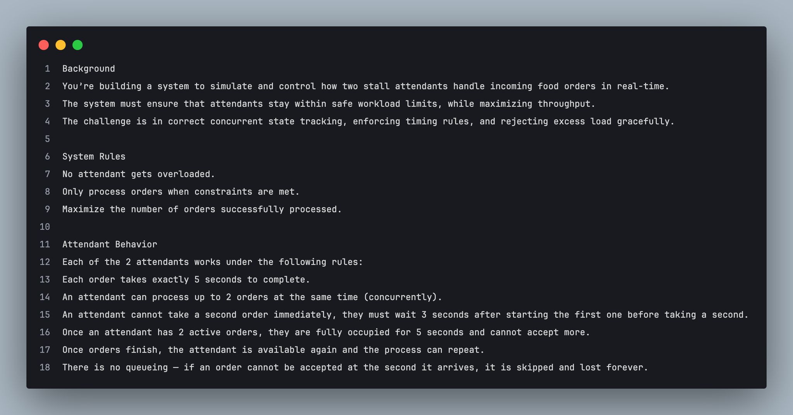
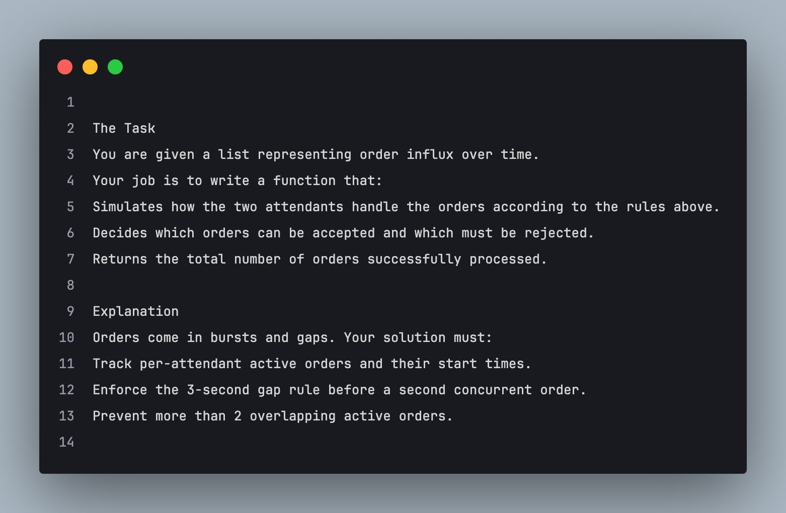

#  Order/Task Management and Scheduling Simulator


## What's This About?

Based-off a challenge posted on the ReactJS Devs Group, a challenge was dropped by Ola (@1finedev) as follows:

## Original Problem Screenshots by @1finedev"


# Real World Example


**The Premise (Summary)**:  
Imagine a small coffee shop with two baristas (similar to the two attendants). Customers arrive at random times to place orders for coffee. Each coffee takes exactly 5 minutes to prepare.

- Each barista can work on up to 2 coffee orders at the same time (e.g., they can multitask).
- However, to avoid mistakes, if a barista starts a second order, they must wait at least 3 minutes after starting the first one (perhaps to ensure the first order is partially completed before starting the next).
- If a barista is already working on 2 orders, they cannot take any more until at least one of the orders is finished (after 5 minutes from the start of the second order).
- Customers are impatient—if no barista can take their order immediately when they arrive, they leave without ordering.

The goal is to serve as many customers as possible without overloading the baristas.

## How It *Actually* Works

---

## Core System Architecture

### Event-Driven Simulation Engine
- **Priority Event Queue**:  
  Uses "heapq" to manage temporal events in chronological order
  ```python
  heapq.heappush(event_queue, Event(time, type, data))
  ```
- **Event Types**:
   - `order_arrival`: Triggered by new customer requests
   - `order_completion`: Scheduled 5 seconds after order acceptance

### Worker Management System
- **Attendant State Tracking**:
  ```python
  class Attendant:
      def update_state(self, current_time):
          # Maintains active orders and calculates availability
          self.active_orders = [t for t in self.active_orders if t + 5 > current_time]
  ```
- **Capacity Constraints**:
   - Maximum 2 concurrent orders per worker
   - 3-second cooldown after starting first order
   - Status states: active/inactive/overloaded

### Scheduling Logic
- **Order Assignment Algorithm**:
  ```python
  priority = (len(active_orders), random.random())
  ```
   - Primary factor: Current order load
   - Secondary factor: Randomization for load balancing
- **Automatic Completion Scheduling**:
  ```python
  heapq.heappush(event_queue, Event(current_time + 5, 'order_completion', ...)
  ```

### Key Workflow
1. Order arrival triggers event queue processing
2. System checks all attendant's availability:
   - Validates status (active/inactive).
   - Verifies temporal constraints (cooldown period).
   - Checks concurrent order limit.
3. Selects optimal worker using priority scoring
4. Updates worker state and schedules completion
5. Handles order rejection when no workers available

---
